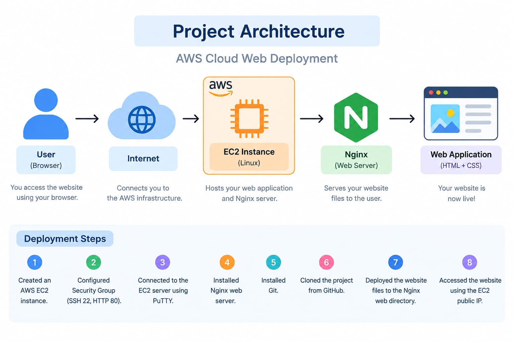

# AWS Cloud Web Deployment

## Project Overview

This project demonstrates how to deploy a simple web application on AWS EC2 using Linux, Nginx, and GitHub.

## Technologies Used

- AWS EC2
- Linux
- Nginx
- Git
- GitHub
- HTML
- CSS

## Deployment Steps

1. Created an AWS EC2 instance.
2. Configured Security Group with SSH (22) and HTTP (80).
3. Connected to the EC2 server using PuTTY.
4. Installed Nginx web server.
5. Installed Git.
6. Cloned the project from GitHub.
7. Deployed the website files to the Nginx web directory.
8. Accessed the website using the EC2 Public IP.

## Project Architecture

## Project Architecture

## Result

The web application was successfully deployed and accessed through the AWS EC2 public IP.

## Author

Nandini
